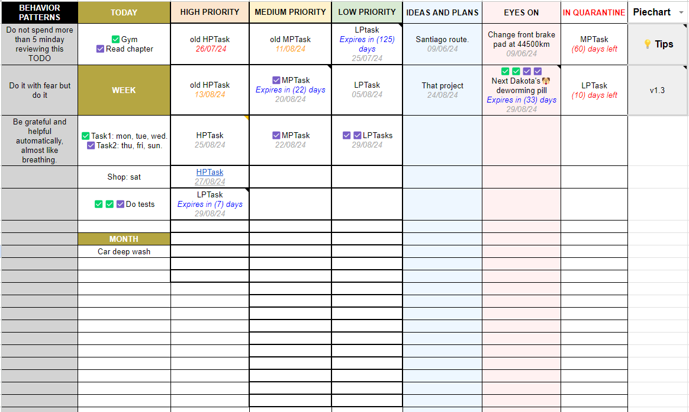
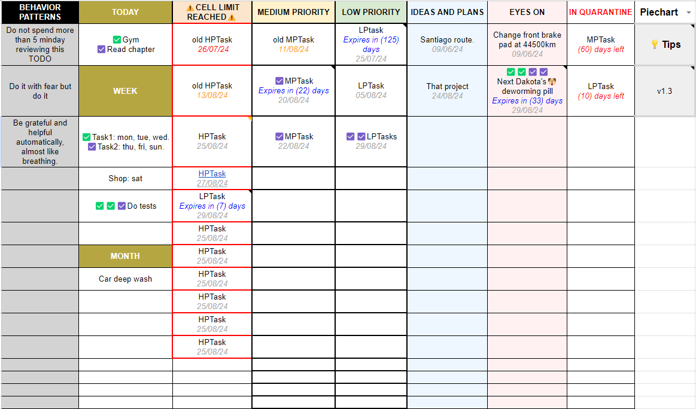
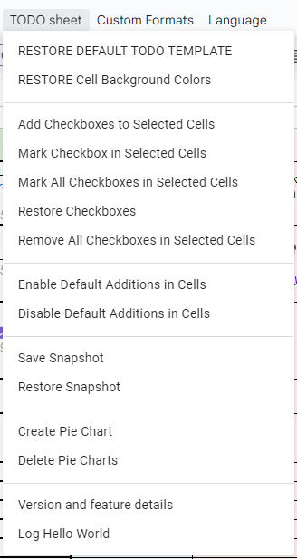

# My own customized "Google Apps Script" code (v1.3.0)

Personal repo for my own customized "Google - Apps Scripts" code to enhance Google Sheets with additional formatting, validation, and automation capabilities.

The initial idea was just to practice the integration from this repo up to Google Apps Script via GitHub Actions, but later I decided to also publish the small improvements that I am making in my custom template for the TODO sheet that I use on a daily basis.

Apps Script uses Javascript and runs on Google Cloud.

#### Sample views: 

 

 

 

## Quick Testing in Google Apps Script

To quickly test the code in Google Apps Script, you can copy the raw contents of the concatenated JavaScript file `concat-script.js` and paste it into the Apps Script editor. Follow these steps:

1. **Open the [concat-script.js](https://raw.githubusercontent.com/fitfulg/usual-googlesheets-scripts/main/concat-script.js) file and copy its contents.**

2. **Open your Google Sheets document.**

3. **Go to Extensions > Apps Script.**

4. **Delete any existing code in the script editor.**

5. **Paste the contents of `concat-script.js` into the script editor.**

6. **Save the script and refresh your Google Sheets document.**

## New Features in v1.3.0

#### Expiration Date in Cells
You can now add an expiration date to your cells. It is a countdown by days. See the "Tips" cell for more information.

#### Notes for Expiration Dates
Cells with expiration dates come with notes added that are used to calculate and update the expiration days.

#### Enable/Disable Default Additions
You can now enable or disable all the functionalities that are added by default when writing in a cell. For example, for a cell to have only text, without checkboxes or default date. This can be managed from the "TODO Sheet" / "Enable/Disable Default Additions in Cells" menu.

## Other Features

#### Languages
You can choose to switch between English, Spanish and Catalan.

#### Default Checkbox Addition
A checkbox is added by default from the 3rd to the 8th column when a cell is written or modified.

#### Checkbox Management
You can add, mark, restore, and delete checkboxes in cells by selecting them and using the "Custom Formats" menu.

#### Daily "Days Left" Counter
The "days left" counter is updated daily in the 8th column. When the counter reaches zero, the cell is cleared.

#### Snapshot Save and Restore
A snapshot of the sheet can be saved and restored from the "Custom Formats" menu.

#### Cell Priority Limits
Indicative limit of cells for each priority, with a warning when the limit is reached.

#### Custom Format Application
Custom formats can be applied without refreshing the page from the "Custom Formats" menu.

#### Date Color Change by Priority
Date color change times vary by column priority.

#### Piechart Toggle
The Piechart can be shown or hidden using its dropdown cell.

#### Automatic Cell Shift
Deleted empty cells are replaced by the immediately lower cell.